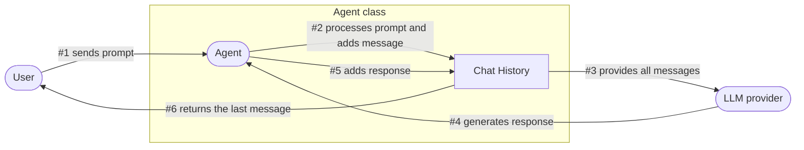

<Note>
  Chat history is a crucial component that allows your agents to maintain
  context across multiple interactions, providing a more natural and coherent
  conversation experience.
</Note>

## Built-in Chat Histories

LarAgent provides several built-in chat history implementations to suit different needs:

<Tabs>
  <Tab title="In Laravel">
  Set in your Agent class by the name:
  ```php yourAgent.php
  // Stores chat history temporarily in memory (lost after request)
  protected $history = 'in_memory';  
  
  // Uses Laravel's session storage
  protected $history = 'session';    
  
  // Uses Laravel's cache system
  protected $history = 'cache';      
  
  // Stores in files (storage/app/chat-histories)
  protected $history = 'file';       
  
  // Stores in JSON files (storage/app/chat-histories)
  protected $history = 'json';       
  ```
  Or use it by class:
  ```php yourAgent.php
 protected $history = \LarAgent\History\SessionChatHistory::class;
  ```
  Or use it by override method to add custom logic or configuration:
  ```php yourAgent.php
    public function createChatHistory($name)
    {
        return new JsonChatHistory($name, ['folder' => __DIR__.'/json_History']);
    }
  ```
  
  </Tab>
  <Tab title="Outside Laravel">
  ```php
    use LarAgent\History\InMemoryChatHistory;
    use LarAgent\History\JsonChatHistory;
    use LarAgent\Drivers\OpenAi\OpenAiDriver;
    use LarAgent\LarAgent;

    $driver = new OpenAiDriver(['api_key' => 'your-api-key']);

    // Stores chat history in memory (lost after each request)
    $history = new InMemoryChatHistory('user-123');

    // Or in JSON files
    $history = new JsonChatHistory('user-123', ['folder' => __DIR__.'/json_History']);

    // Setup LarAgent
    $agent = LarAgent::setup($driver, $history, [
        'model' => 'gpt-4', // or any other model
    ]);

````
</Tab>
</Tabs>

## Chat History Configuration

You can configure how chat history behaves using these properties in your Agent class:

### Reinjecting Instructions

```php
/** @var int - Number of messages after which to reinject the agent's instructions */
protected $reinjectInstructionsPer;
````

Instructions are always injected at the beginning of the chat history. The `$reinjectInstructionsPer` property defines when to reinject these instructions to ensure the agent stays on track. By default, it's set to `0` (disabled).

<Tip>
  Reinjecting instructions can be useful for long conversations where the agent
  might drift from its original purpose or forget important constraints.
</Tip>

### Managing Context Window Size

```php
/** @var int - Maximum number of tokens to keep in context window */
protected $contextWindowSize;
```

After the context window is exceeded, the oldest messages are removed until the context window is satisfied or the limit is reached. This helps manage token usage and ensures the conversation stays within the model's context limits.

### How chat history works



The flow of information in the chat history process works as follows:

1. **User to Agent**: The user sends a prompt to the agent.
2. **Agent to Chat History**: The agent processes and adds the user's message to the chat history.
3. **Chat History to Agent**: The agent retrieves all relevant messages from the chat history.
4. **Agent to LLM**: The agent sends these messages as context to the language model.
5. **LLM to Agent**: The language model generates a response based on the provided context.
6. **Agent to Chat History**: The agent processes and adds the LLM's response to the chat history.
7. **Agent to User**: The agent displays the last message from the chat history to the user.

Throughout this process, the Context Window Management system:

- Tracks all messages in the conversation
- Counts tokens to ensure they stay within model limits
- Prunes older messages when necessary to maintain the context window size

#### Extensibility

You can implement custom logic for context window management using [events](/customization/events) and the chat history instance inside your agent.
Or create [custom chat history](#creating-custom-chat-histories) implementations by implementing the `ChatHistoryInterface`.

## Using Chat History

### Per-User Chat History

One of the most common use cases is maintaining separate chat histories for different users:

```php
// Create a chat history for a specific user
$response = MyAgent::forUser(auth()->user())->respond('Hello, how can you help me?');

// Later, the same user continues the conversation
$response = MyAgent::forUser(auth()->user())->respond('Can you explain more about that?');
```

### Named Chat Histories

You can also create named chat histories for specific contexts or topics:

```php
// Start a conversation about weather
$response = MyAgent::for('weather_chat')->respond('What's the weather like today?');

// Start a separate conversation about recipes
$response = MyAgent::for('recipe_chat')->respond('How do I make pasta carbonara?');

// Continue the weather conversation
$response = MyAgent::for('weather_chat')->respond('Will it rain tomorrow?');
```

## Accessing and Managing Chat History

LarAgent provides several methods to access and manage chat history:

<CodeGroup>
```php Accessing History
// Get the current chat history instance
$history = $agent->chatHistory();

// Get all messages in the chat history
$messages = $history->getMessages();

// Get the last message (MessageInterface)
$lastMessage = $history->getLastMessage();

// Count messages in history
$count = $history->count();

// Get the chat history identifier
$identifier = $history->getIdentifier();

// Convert messages to array
$messagesArray = $history->toArray();

// Convert messages to array with metadata
$messagesWithMeta = $history->toArrayWithMeta();

````

```php Managing History
// Clear the current chat history
$agent->clear();

// Set a different chat history instance at runtime
$agent->setChatHistory(new CustomChatHistory('custom_identifier'));

// Get all chat keys associated with this agent class
$chatKeys = $agent->getChatKeys();

// Add a message to chat history
$history->addMessage(new Message('user', 'Hello, agent!'));

// Set context window size (in tokens)
$history->setContextWindow(4000);

// Check if context exceeds the token amount
if (!$history->exceedsContextWindow(500)) {
    // Safe to add more content
}
````

</CodeGroup>

<Note>
  The `addMessage(MessageInterface $message)` method adds a new message to the
  chat history instance, which will be saved automatically by the agent class if
  you are using it in agent context. In other case, you can save it manually
  using `writeToMemory()` method.
</Note>

## Creating Custom Chat Histories

You can create your own chat history by implementing the `ChatHistoryInterface` and extending the `LarAgent\Core\Abstractions\ChatHistory` abstract class.

Check example implementations in [src/History](https://github.com/MaestroError/LarAgent/tree/main/src/History)

There are two ways to register your custom chat history into an agent. If you use standard constructor only with `$name` parameter, you can define it by class in `$history` property or provider configuration:

**Agent Class**

```php
protected $history = \App\ChatHistories\CustomChatHistory::class;
```

**Provider Configuration (config/laragent.php)**

```php
'chat_history' => \App\ChatHistories\CustomChatHistory::class,
```

If you need any configuration other than `$name`, you can override `createChatHistory()` method:

```php
public function createChatHistory($name)
{
    return new \App\ChatHistories\CustomChatHistory($name, [
      // Added config
      'folder' => __DIR__.'/history',
      // Default configs used inside Agent class:
      'context_window' => $this->contextWindowSize,
      'store_meta' => $this->storeMeta,
      'save_chat_keys' => $this->saveChatKeys,
    ]);
}
```

## Storing usage data

You can store usage data (if available) automatically in the chat history by setting `store_meta` config or `$storeMeta` property to `true`:

```php
protected $storeMeta = true;
```

This will store usage data (if available) in the chat history as metadata of message. 
Each message supports `toArrayWithMeta()` method to get array with metadata:

```php
// Example
$message = $message->toArrayWithMeta();

// Result
[
  // Other message properties
  'usage' => [
    'prompt_tokens' => 10,
    'completion_tokens' => 20,
    'total_tokens' => 30,
    // Other usage details
  ],
]
```

<Warning>
  Before v0.5 keys was stored as `promptTokens` (camelCase) instead of `prompt_tokens` (snake_case), so make sure to update your code if you were using it.
</Warning>

Alternatively, you can store usage data manually using `afterResponse` hooks in your agent class:
```php
protected function afterResponse($message)
{
    $messageArray = $message->toArrayWithMeta();
    
    // Store usage data
    Usage::create([
        'agent_name' => class_basename($this),
        'user_id' => auth()->user()->id,
        'prompt_tokens' => $messageArray['usage']['prompt_tokens'],
        'completion_tokens' => $messageArray['usage']['completion_tokens'],
        'total_tokens' => $messageArray['usage']['total_tokens'],
    ]);
}
```

## Best Practices

<Check>
  **Do** choose the appropriate chat history implementation based on your needs
  (persistence, performance, etc.)
</Check>

<Check>
  **Do** set a reasonable context window size to balance coherence and token
  usage
</Check>

<Check>
  **Do** use unique identifiers for chat histories to prevent
  cross-contamination
</Check>

<Icon icon="x" iconType="solid" color="red" /> **Don't** store sensitive information
in chat histories without proper encryption

<Icon icon="x" iconType="solid" color="red" /> **Don't** neglect to clear chat histories
when they're no longer needed
