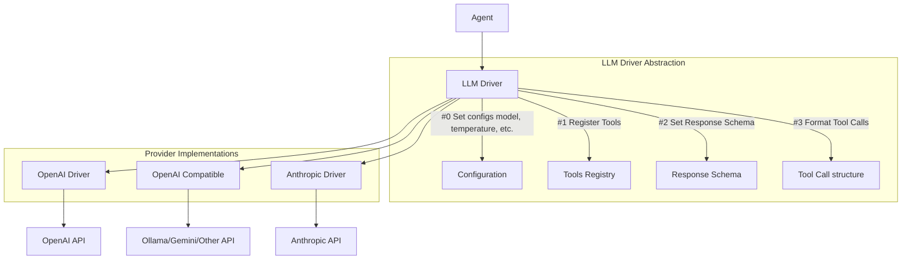

<Note>
LLM Drivers allow you to switch between different AI providers (like OpenAI, Ollama, or OpenRouter) without changing your application code, providing flexibility and vendor independence.
</Note>

## Understanding LLM Drivers

LLM Drivers provide a standardized interface for interacting with different language model providers, allowing you to easily switch between providers without changing your application code.

The built-in drivers implement this interface and provide a simple way to use various AI APIs with a consistent interface.

Check [Creating Custom Drivers](#creating-custom-drivers) for more details about building custom drivers.


## Available Drivers

<CardGroup cols={2}>
  <Card title="OpenAiDriver" icon="robot">
    Default driver for OpenAI API. Works with minimal configuration - just add your `OPENAI_API_KEY` to your `.env` file.
  </Card>
  <Card title="OpenAiCompatible" icon="plug">
    Works with any OpenAI-compatible API, allowing you to use alternative backends with the same API format.
  </Card>
  <Card title="GeminiDriver" icon="google">
    Works with Google Gemini API via OpenAI compatible endpoint
  </Card>
</CardGroup>

## Configuring Drivers

You can configure LLM drivers in two ways:

### 1. Global Configuration

Set drivers in the configuration file inside provider settings (`config/laragent.php`):

```php {5}
'providers' => [
    'default' => [
        'label' => 'openai',
        'api_key' => env('OPENAI_API_KEY'),
        'driver' => \LarAgent\Drivers\OpenAi\OpenAiDriver::class,
    ],
],
```

### 2. Per-Agent Configuration

Set the driver directly in your agent class:

```php app/AiAgents/YourAgent.php
namespace App\AiAgents;

use LarAgent\Agent;
use LarAgent\Drivers\OpenAi\OpenAiCompatible;

class YourAgent extends Agent
{
    protected $driver = OpenAiCompatible::class;
    // Other agent configuration
}
```
<Warning>
If you set the driver in the agent class, it will override the global configuration.
</Warning>

## Example Configurations

### Ollama (Local LLM)

```php
// File: config/laragent.php
'providers' => [
    'ollama' => [
        'label' => 'ollama-local',
        'driver' => \LarAgent\Drivers\OpenAi\OpenAiCompatible::class,
        'api_key' => 'ollama', // Can be any string for Ollama
        'api_url' => "http://localhost:11434/v1",
        'default_context_window' => 50000,
        'default_max_completion_tokens' => 100,
        'default_temperature' => 1,
    ],
],
```

```php
// In your agent class
protected $provider = 'ollama';
protected $model = 'llama2'; // Or any other model available in your Ollama instance
```

### OpenRouter

```php
// File: config/laragent.php
'providers' => [
    'openrouter' => [
        'label' => 'openrouter-provider',
        'driver' => \LarAgent\Drivers\OpenAi\OpenAiCompatible::class,
        'api_key' => env('OPENROUTER_API_KEY'),
        'api_url' => "https://api.openrouter.ai/api/v1",
        'default_context_window' => 50000,
        'default_max_completion_tokens' => 100,
        'default_temperature' => 1,
    ],
],
```

```php
// In your agent class
protected $provider = 'openrouter';
protected $model = 'anthropic/claude-3-opus'; // Or any other model available on OpenRouter
```

### Gemini
```php
'gemini' => [
    'label' => 'gemini',
    'model'=>'gemini-2.5-pro-preview-03-25',
    'driver'=>\LarAgent\Drivers\OpenAi\GeminiDriver::class,
    'api_key' => env('GEMINI_API_KEY'),
]
```

```php
// In your agent class
protected $provider = 'gemini';
```

<Note>
  Gemini driver doesn't support streaming yet.
</Note>

## Fallback Provider

There is a fallback provider that is used when the current provider fails to process a request.
By default, it's set to the default provider:
```php
// File: config/laragent.php
'fallback_provider' => 'default',
```

You can set any provider as fallback provider in configuration file, just replace "default" with your provider name:

**Example configuration**
```php {32}
return [
    // ...
    'providers' => [
        'default' => [
            'name' => 'openai',
            'model' => 'gpt-4o-mini',
            'driver' => \LarAgent\Drivers\OpenAi\OpenAiCompatible::class,
            'api_key' => env('OPENAI_API_KEY'),
            'default_context_window' => 50000,
            'default_max_completion_tokens' => 100,
            'default_temperature' => 1,
        ],
        'ollama' => [
            'name' => 'ollama-local',
            // Required configs for fallback provider:
            'model' => 'llama3.2',
            'api_key' => 'ollama',
            'api_url' => "http://localhost:11434/v1",
            'driver' => \LarAgent\Drivers\OpenAi\OpenAiCompatible::class,
        ],
        'gemini' => [
            'name' => 'gemini provider',
            'model' => 'model-GEMINI',
            'driver' => \LarAgent\Drivers\OpenAi\GeminiDriver::class,
            'api_key' => env('GEMINI_API_KEY'),
            'default_context_window' => 500000,
            'default_max_completion_tokens' => 10000,
            'default_temperature' => 0.8,
        ],
    ],

    'fallback_provider' => 'ollama',
];
```

<Warning>
It is recommended to have a 'model' set in provider which is used as a fallback.
</Warning>

You can disable fallback provider by setting `fallback_provider` to `null` in configuration file or just by removing it.

## LLM Drivers Architecture



The LLM Driver architecture handles three key responsibilities:

1. **Tool Registration** - Register function calling tools that can be used by the LLM
2. **Response Schema** - Define structured output formats for LLM responses
3. **Tool Call Formatting** - Abstract away provider-specific formats for tool calls and results

This abstraction allows you to switch between different LLM providers without changing your application code.

## Creating Custom Drivers

If you need to integrate with an AI provider that doesn't have a built-in driver, you can create your own by implementing the `LlmDriver` interface:

```php
namespace App\LlmDrivers;

use LarAgent\Core\Abstractions\LlmDriver;
use LarAgent\Core\Contracts\LlmDriver as LlmDriverInterface;
use LarAgent\Core\Contracts\ToolCall as ToolCallInterface;
use LarAgent\Messages\AssistantMessage;
use LarAgent\Messages\StreamedAssistantMessage;
use LarAgent\Messages\ToolCallMessage;
use LarAgent\ToolCall;

class CustomProviderDriver extends LlmDriver implements LlmDriverInterface
{
    
    public function sendMessage(array $messages, array $options = []): AssistantMessage
    {
        // Implement the API call to your provider
    }
    
    public function sendMessageStreamed(array $messages, array $options = [], ?callable $callback = null): \Generator
    {
        // Implement streaming for your custom provider
    }

    public function toolCallsToMessage(array $toolCalls): array
    {
        // Implement tool calls to message conversion
    }
    
    public function toolResultToMessage(ToolCallInterface $toolCall, mixed $result): array
    {
        // Implement tool result to message conversion
    }
    // Implement other helper methods...
}
```

Then register your custom driver in the configuration:

```php
// config/laragent.php
'providers' => [
    'custom' => [
        'label' => 'my-custom-provider',
        'driver' => \App\LlmDrivers\CustomProviderDriver::class,
        'api_key' => env('CUSTOM_PROVIDER_API_KEY'),
        'api_url' => env('CUSTOM_PROVIDER_API_URL'),
        'model' => 'model-name',
        // Any other configuration your driver needs
    ],
],
```

Check [Base OpenAI driver](https://github.com/MaestroError/LarAgent/blob/main/src/Drivers/OpenAi/BaseOpenAiDriver.php) for example.

## Best Practices

<Check>
**Do** store API keys in environment variables, never hardcode them
</Check>

<Check>
**Do** set reasonable defaults for context window and token limits
</Check>

<Check>
**Do** consider implementing fallback mechanisms between providers
</Check>

<Icon icon="x" iconType="solid" color="red" /> **Don't** expose sensitive provider configuration in client-side code

<Icon icon="x" iconType="solid" color="red" /> **Don't** assume all providers support the same features (like function calling or parallel tool execution)
