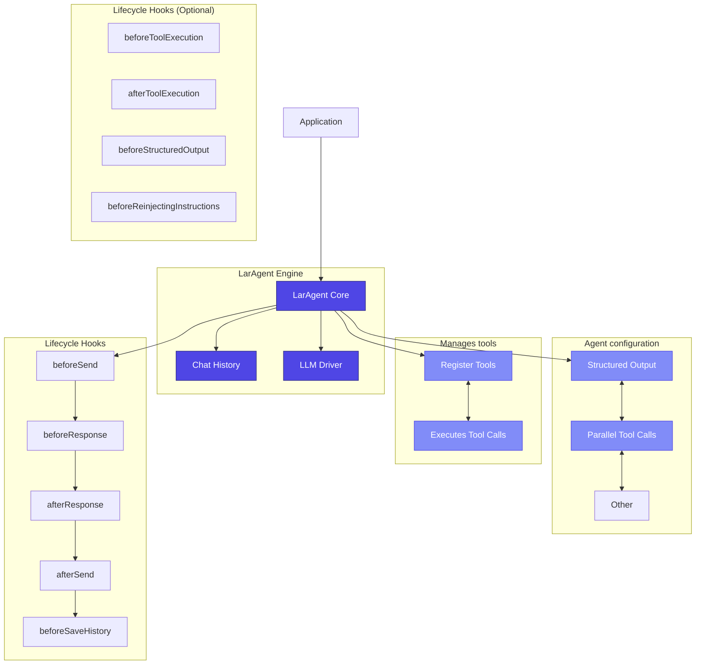

<Warning>
**Important Notice**: LarAgent will soon drop support for direct usage outside of Laravel. However, the core engine will be released as a separate package with the same API (methods/functions), ensuring continued support for non-Laravel projects.
</Warning>

## Understanding engine

LarAgent's core functionality is powered by the `LarAgent\LarAgent` class, often referred to as the "LarAgent engine." This engine is a standalone component that contains all the abstractions and doesn't depend on Laravel. It manages agents, tools, chat histories, structured output, and other core features.



## Getting Started

To use LarAgent outside of Laravel, you'll need to handle some configuration and initialization manually:

```php
<?php

require_once __DIR__.'/vendor/autoload.php';

use LarAgent\Drivers\OpenAi\OpenAiDriver;
use LarAgent\History\InMemoryChatHistory;
use LarAgent\LarAgent;
use LarAgent\Message;

// Setup
$yourApiKey = 'your-openai-api-key'; // Replace with your actual API key
$driver = new OpenAiDriver(['api_key' => $yourApiKey]);
$chatKey = 'test-chat-history';
$chatHistory = new InMemoryChatHistory($chatKey);

$agent = LarAgent::setup($driver, $chatHistory, [
    'model' => 'gpt-4o-mini',
]);

// Add a message and get a response
$userMessage = Message::user('Hello, how can you help me?');
$agent->withMessage($userMessage);
$response = $agent->run();

echo $response;
```

## Configuring Structured Output

You can define structured output schemas to get responses in a specific format:

```php
// Define a structured output schema
$weatherInfoSchema = [
    'name' => 'weather_info',
    'schema' => [
        'type' => 'object',
        'properties' => [
            'locations' => [
                'type' => 'array',
                'items' => [
                    'type' => 'object',
                    'properties' => [
                        'city' => ['type' => 'string'],
                        'weather' => ['type' => 'string'],
                    ],
                    'required' => ['city', 'weather'],
                    'additionalProperties' => false,
                ],
            ],
        ],
        'required' => ['locations'],
        'additionalProperties' => false,
    ],
    'strict' => true,
];

// Use the schema with the agent
$userMessage = Message::user('What\'s the weather like in Boston and Los Angeles? I prefer celsius');
$agent->structured($weatherInfoSchema)->withMessage($userMessage);
$response = $agent->run();

// The response will be a structured array
print_r($response);

/* Outputs:
Array
(
    [locations] => Array
        (
            [0] => Array
                (
                    [city] => Boston, MA
                    [weather] => The weather is 22 degrees Celsius.
                )

            [1] => Array
                (
                    [city] => Los Angeles, CA
                    [weather] => The weather is 22 degrees Celsius.
                )
        )
)
*/
```

## Adding Tools

You can add tools to the agent using the `Tool` class:

```php
use LarAgent\Tool;

// Create a tool
$toolName = 'get_current_weather';

$tool = Tool::create($toolName, 'Get the current weather in a given location');

$tool->addProperty('location', 'string', 'The city and state, e.g. San Francisco, CA')
    ->addProperty('unit', 'string', 'The unit of temperature', ['celsius', 'fahrenheit'])
    ->setRequired('location')
    ->setMetaData(['sent_at' => '2024-01-01'])
    ->setCallback(function ($location, $unit = 'fahrenheit') {
        // "Call the weather API"
        return 'The weather in '.$location.' is 72 degrees '.$unit;
    });

// Add the tool to the agent
$agent->setTools([$tool]);
```

## Use Chat History

Outside of Laravel, you'll need to create and pass chat history instance into setup method:

```php
use LarAgent\History\JsonChatHistory;

// Setup
$yourApiKey = 'your-openai-api-key'; // Replace with your actual API key
$driver = new OpenAiDriver(['api_key' => $yourApiKey]);
$chatHistory = new JsonChatHistory('test-chat-history');

$agent = LarAgent::setup($driver, $chatHistory, [
    'model' => 'gpt-4o-mini',
]);

```
There is 2 availble chat history classes for usage outside of Laravel:

- `JsonChatHistory`
- `InMemoryChatHistory`

You can easily implement your own, check [custom-chat-history](customization/custom-chat-history) for more information.

## Differences from Laravel Usage

When using LarAgent outside of Laravel, be aware of these key differences:

<CardGroup cols={2}>
  <Card title="Manual Configuration" icon="gear">
    You need to provide all configuration directly instead of using Laravel's config system.
  </Card>
  <Card title="No Artisan Commands" icon="terminal">
    You won't have access to the helpful artisan commands for generating agents and tools.
  </Card>
  <Card title="LangChain-like usage" icon="book">
    Instead of classes, you will create Agents using `LarAgent::setup()`
  </Card>
  <Card title="No Service Container" icon="box">
    You can't leverage Laravel's service container for dependency injection.
  </Card>
</CardGroup>

## Future Plans

<Note>
As mentioned at the top of this page, LarAgent will soon separate its core engine into a standalone package. This will provide a cleaner, more focused API for non-Laravel projects while maintaining full compatibility with the current methods and functions.
</Note>

The standalone engine will offer:

- Improved documentation specifically for non-Laravel usage
- Simplified installation for PHP projects
- Reduced dependencies
- The same powerful features you're used to in LarAgent

Stay tuned to the [official repository](https://github.com/MaestroError/LarAgent) for announcements about this upcoming change.

## Complete Example

Here's a complete example combining structured output, tools, and custom instructions:

```php
use LarAgent\Drivers\OpenAi\OpenAiDriver;
use LarAgent\History\InMemoryChatHistory;
use LarAgent\LarAgent;
use LarAgent\Message;
use LarAgent\Messages\ToolCallMessage;
use LarAgent\Tool;

// Setup
$driver = new OpenAiDriver(['api_key' => $yourApiKey]);
$chatHistory = new InMemoryChatHistory('weather-chat');

$agent = LarAgent::setup($driver, $chatHistory, [
    'model' => 'gpt-4o-mini',
]);

// Create a weather tool
$weatherTool = Tool::create('get_current_weather', 'Get the current weather in a given location')
    ->addProperty('location', 'string', 'The city and state, e.g. San Francisco, CA')
    ->addProperty('unit', 'string', 'The unit of temperature', ['celsius', 'fahrenheit'])
    ->setRequired('location')
    ->setCallback(function ($location, $unit = 'fahrenheit') {
        return 'The weather in '.$location.' is 72 degrees '.$unit;
    });

// Define structured output schema
$weatherInfoSchema = [
    'name' => 'weather_info',
    'schema' => [
        'type' => 'object',
        'properties' => [
            'locations' => [
                'type' => 'array',
                'items' => [
                    'type' => 'object',
                    'properties' => [
                        'city' => ['type' => 'string'],
                        'weather' => ['type' => 'string'],
                    ],
                    'required' => ['city', 'weather'],
                ],
            ],
        ],
        'required' => ['locations'],
    ],
    'strict' => true,
];

// Set up the agent with all components
$userMessage = Message::user('What\'s the weather like in Boston and Los Angeles? I prefer celsius');
$instructions = 'You are weather assistant and always respond using celsius. If it provided as fahrenheit, convert it to celsius.';

$agent->setTools([$weatherTool])
    ->structured($weatherInfoSchema)
    ->withInstructions($instructions)
    ->withMessage($userMessage);

// Get the structured response
$response = $agent->run();
