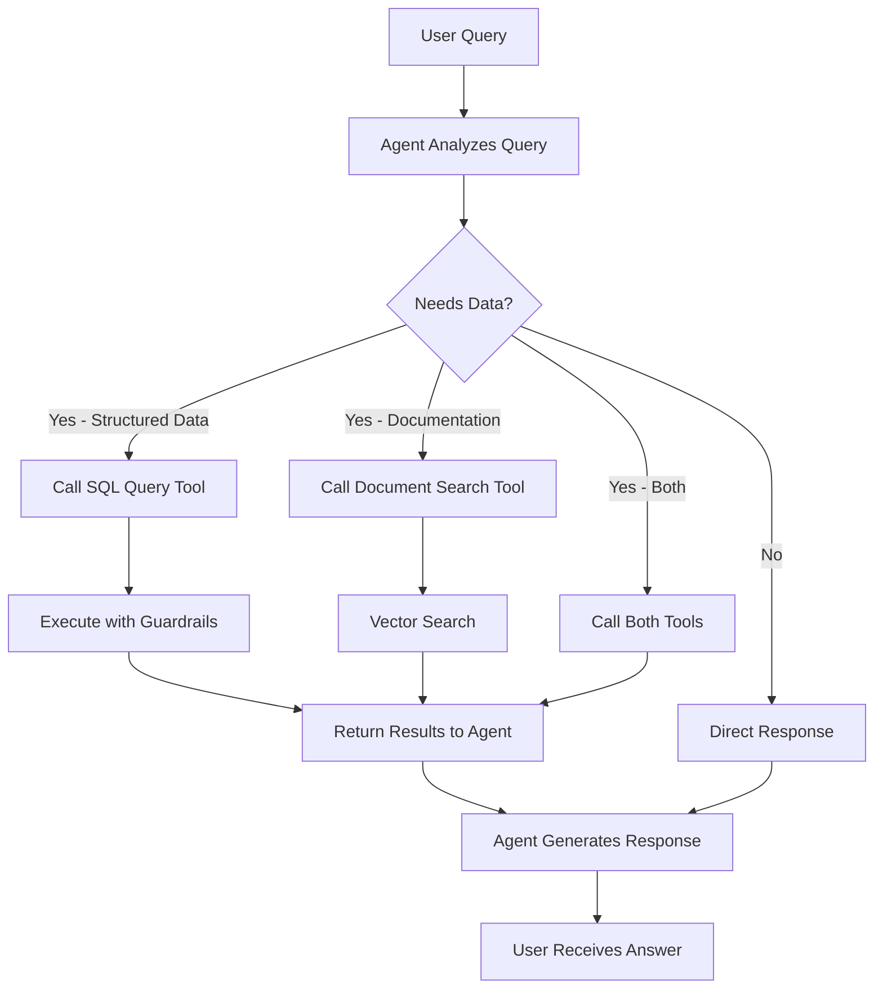

<Warning>

This guide is designed for **educational purposes** to help you understand RAG concepts and how they work in LarAgent and AI development. The prompts, configurations, and implementations provided here are **not fine-tuned or extensively tested** for production use.

Use this guide to learn and experiment, then build upon it with production-grade practices.

</Warning>

<Note>
  Retrieval-as-Tool is an advanced RAG approach where the AI agent **decides
  when and what to retrieve** based on the conversation context. Unlike
  traditional RAG that retrieves context for every query, this method gives the
  agent tools to fetch information only when needed, making it more efficient
  and context-aware.
</Note>

In this guide, we'll implement a **smart support agent** with two retrieval tools:

1. **SQL Query Tool** - For retrieving structured data from databases (users, orders, settings, etc.)
2. **Document Search Tool** - For searching unstructured documentation using vector embeddings

The agent will intelligently choose which tool (or both) to use based on the user's question.

## How Retrieval-as-Tool Works



The key difference:

- **Traditional RAG**: Retrieves context for _every_ query in the `prompt` method
- **Retrieval-as-Tool**: Agent _decides_ when to retrieve and what data source to query

## Understanding the SQL Query Approach

<Warning>
  The SQL query tool in this guide is designed for **structured data retrieval**
  (database records like users, orders, products) and **NOT for document
  retrieval**. For unstructured documents and FAQs, we'll use the Document
  Search tool with vector embeddings.
</Warning>

This dual-tool approach allows your agent to:

- Query database tables for precise, structured information
- Search documentation for conceptual knowledge and procedures
- Combine both when needed (e.g., "Show me user John's order history and the return policy")

## Prerequisites

Before starting this guide, make sure you have:

<AccordionGroup>
    <Accordion title="LarAgent Installed">
        You should have LarAgent installed and configured. If not, check the [Quickstart](/quickstart) guide.
        
        ```bash
        composer require maestroerror/laragent
        ```
    </Accordion>

    <Accordion title="Database Access">
        Ensure your Laravel application has database access configured. We'll be using
        `DB::select()` for safe, read-only queries.
    </Accordion>

    <Accordion title="Vector Search Service (for Document Tool)">
        For the document search tool, you'll need a vector database:
        - **[Qdrant](https://github.com/hkulekci/qdrant-php)**
        - **[Pinecone](https://github.com/probots-io/pinecone-php)**
        - **[pgvector](https://github.com/pgvector/pgvector)**
    </Accordion>

    <Accordion title="Embeddings Generator">
        We recommend using `openai-php/client` since LarAgent already provides it.

        ```bash
        # Usually already installed with LarAgent
        composer require openai-php/client
        ```
    </Accordion>

</AccordionGroup>

<Tip>
  Make sure you have some data in your database and documents indexed in your
  vector database for testing.
</Tip>

## Implementation Steps

### Step 1: Create Your Support Agent

Create a new agent using the artisan command:

```bash
php artisan make:agent SmartSupportAgent
```

This will generate a new agent class at `app/AiAgents/SmartSupportAgent.php`.

### Step 2: Define Agent Instructions

Create a blade template for your agent's instructions:

```blade resources/views/prompts/smart_support_instructions.blade.php
# Purpose

You are an intelligent customer support agent with access to both database and documentation.

Your role is to assist users by:
- Retrieving relevant information from the database when needed (user data, orders, settings)
- Searching documentation for policies, procedures, and how-to guides
- Combining information from multiple sources when necessary

**Important Guidelines:**
- Use the `queryDatabase` tool for structured data queries (users, orders, products, etc.)
- Use the `searchDocumentation` tool for unstructured information (FAQs, guides, policies)
- Only retrieve data when necessary to answer the question
- Be helpful, accurate, and professional
- Never make up information - only use data from tools or general knowledge

Current Date: {{ $date }}

## Current User Context

Name: {{ $user->name ?? 'Guest' }}
Email: {{ $user->email ?? 'N/A' }}
User ID: {{ $user->id ?? 'N/A' }}

## Database Schema

You have access to the following database tables for queries:

### users
- id (int, primary key)
- name (string)
- email (string)
- email_verified_at (timestamp)
- subscription_type (string: 'free', 'basic', 'premium')
- created_at (timestamp)
- updated_at (timestamp)

### orders
- id (int, primary key)
- user_id (int, foreign key to users.id)
- total (decimal)
- status (string: 'pending', 'completed', 'cancelled', 'refunded')
- created_at (timestamp)
- updated_at (timestamp)

### products
- id (int, primary key)
- name (string)
- description (text)
- price (decimal)
- category (string)
- stock (int)
- is_active (boolean)
- created_at (timestamp)
- updated_at (timestamp)

### order_items
- id (int, primary key)
- order_id (int, foreign key to orders.id)
- product_id (int, foreign key to products.id)
- quantity (int)
- price (decimal)
- created_at (timestamp)
- updated_at (timestamp)

**Schema Notes:**
- Always use proper JOIN statements when querying related tables
- Use appropriate WHERE clauses to filter results
- Include LIMIT clauses to prevent large result sets
- Remember to respect user privacy and only query data relevant to the question
```

### Step 3: Create the SQL Query Guardrail Agent

Before implementing the main agent, create a guardrail agent that validates SQL queries for safety:

```bash
php artisan make:agent SqlGuardAgent
```

Update the `SqlGuardAgent.php`:

````php app/AiAgents/SqlGuardAgent.php
<?php

namespace App\AiAgents;

use LarAgent\Agent;

class SqlGuardAgent extends Agent
{
    protected $model = 'gpt-4o-mini';
    protected $history = 'in_memory'; // No need to persist guard checks
    protected $temperature = 0; // Deterministic validation

    protected $responseSchema = [
        'name' => 'sql_validation',
        'schema' => [
            'type' => 'object',
            'properties' => [
                'is_safe' => [
                    'type' => 'boolean',
                    'description' => 'Whether the query is safe (read-only)',
                ],
                'reason' => [
                    'type' => 'string',
                    'description' => 'Explanation of why the query is safe or unsafe',
                ],
                'detected_operations' => [
                    'type' => 'array',
                    'items' => ['type' => 'string'],
                    'description' => 'List of SQL operations detected in the query',
                ],
            ],
            'required' => ['is_safe', 'reason', 'detected_operations'],
            'additionalProperties' => false,
        ],
        'strict' => true,
    ];

    public function instructions()
    {
        return view('prompts.detailed_SQL_checking_instruction');
    }

    /**
     * Validate a SQL query for safety
     *
     * @param string $query The SQL query to validate
     * @return array Validation result with is_safe, reason, and detected_operations
     */
    public function validateQuery(string $query): array
    {
        $response = $this->respond("Validate this SQL query:\n\n```sql\n{$query}\n```");

        return $response;
    }
}
````

### Step 4: Implement SQL Query Tool in Your Agent

Now, let's implement the SQL query tool using the `#[Tool]` attribute:

```php app/AiAgents/SmartSupportAgent.php
<?php

namespace App\AiAgents;

use LarAgent\Agent;
use LarAgent\Attributes\Tool;
use App\AiAgents\SqlGuardAgent;
use Illuminate\Support\Facades\DB;

class SmartSupportAgent extends Agent
{
    protected $model = 'gpt-4o';
    protected $history = 'cache';
    protected $temperature = 0.7;
    protected $maxCompletionTokens = 1000;

    public function instructions()
    {
        return view('prompts.smart_support_instructions', [
            'date' => now()->format('F j, Y'),
            'user' => auth()->user(),
        ])->render();
    }

    /**
     * Query the database for structured data
     *
     * This tool allows retrieval of structured information like users, orders, products, etc.
     * The query must be read-only (SELECT statements only).
     */
    #[Tool(
        'Query the database to retrieve structured data like users, orders, products, or settings. Only use for structured data queries.',
        [
            'query' => 'A read-only SQL SELECT query. Must not contain INSERT, UPDATE, DELETE, or other modification statements.',
        ]
    )]
    public function queryDatabase(string $query): string
    {
        try {
            // Validate query using guardrail agent
            $validation = SqlGuardAgent::for("check")->validateQuery($query);

            // Check if query is safe
            if (!$validation['is_safe']) {
                return "Query rejected: {$validation['reason']}\n" .
                       "Detected operations: " . implode(', ', $validation['detected_operations']) . "\n" .
                       "Only SELECT queries are allowed for data retrieval.";
            }

            // Execute the query
            $results = DB::select($query);

            // Format results
            if (empty($results)) {
                return "Query executed successfully but returned no results.";
            }

            // Convert to array and return as JSON for better parsing
            $formattedResults = json_encode($results, JSON_PRETTY_PRINT);

            return "Query executed successfully. Results:\n{$formattedResults}";

        } catch (\Exception $e) {
            return "Error executing query: " . $e->getMessage() .
                   "\nPlease check your SQL syntax and try again.";
        }
    }
}
```

<Note>
  The `queryDatabase` tool validates every SQL query through the `SqlGuardAgent`
  before execution, ensuring only safe SELECT statements are processed. This
  prevents any data modification attempts.
</Note>

### Step 5: Add Document Search Tool with Enum Constraints

Now let's add the document search tool. First, create an Enum to constrain the limit parameter:

```php app/Enums/DocumentLimit.php
<?php

namespace App\Enums;

enum DocumentLimit: int
{
    case THREE = 3;
    case FOUR = 4;
    case FIVE = 5;
}
```

<Tip>
  Using an Enum for the `limit` parameter **frames the LLM's ability to choose**
  by providing a predefined set of valid options. Instead of allowing any
  integer (which could lead to values like 1, 100, or even negative numbers),
  the LLM can only select from the three specific cases: 3, 4, or 5. This
  ensures more predictable behavior and prevents edge cases while still giving
  the agent flexibility to adjust the number of retrieved documents based on the
  query complexity.
</Tip>

Now add the document search tool to your agent:

```php
use App\Enums\DocumentLimit;
use App\Services\QdrantSearchService;

// Add this method to your SmartSupportAgent class

/**
 * Search documentation for unstructured information
 *
 * This tool searches through documentation, FAQs, guides, and policies
 * using semantic vector search.
 */
#[Tool(
    'Search the documentation for unstructured information like FAQs, guides, policies, and procedures. Use this for conceptual questions or how-to queries.',
    [
        'query' => 'The search query or question to find relevant documentation for.',
        'limit' => 'Number of documents to retrieve. Choose based on query complexity.',
    ]
)]
public function searchDocumentation(string $query, DocumentLimit $limit = DocumentLimit::THREE): string
{
    try {
        // Search using Qdrant
        $searchService = new QdrantSearchService();
        $documents = $searchService->search($query, $limit->value);

        // Check if we found any relevant documents
        if (empty($documents)) {
            return "No relevant documentation found for the query: {$query}";
        }

        // Format and return results directly
        return json_encode($documents, JSON_PRETTY_PRINT);

    } catch (\Exception $e) {
        return "Error searching documentation: " . $e->getMessage();
    }
}
```

<Note>
  The simplified implementation returns raw JSON results, allowing the agent to
  interpret and present the information in the most appropriate way based on the
  conversation context. The Enum constraint ensures the agent can only request
  3, 4, or 5 documents, preventing excessive retrieval while maintaining
  flexibility.
</Note>

#### Understanding Enum Benefits

The `DocumentLimit` Enum provides several advantages:

<CardGroup cols={2}>
  <Card title="Type Safety" icon="shield-check">
    Prevents invalid values at the language level
  </Card>
  <Card title="Clear Options" icon="list">
    LLM sees exactly what choices are available
  </Card>
  <Card title="No Validation Needed" icon="circle-xmark">
    Removes need for min/max boundary checks
  </Card>
  <Card title="Semantic Meaning" icon="lightbulb">
    Agent understands these are the only valid options
  </Card>
</CardGroup>

When the LLM receives the tool definition, it sees:

```json
{
  "limit": {
    "type": "integer",
    "enum": [3, 4, 5],
    "description": "Number of documents to retrieve. Choose based on query complexity."
  }
}
```

This constraint guides the agent to make appropriate choices:

- Simple questions → 3 documents (default)
- Moderate complexity → 4 documents
- Complex or multi-faceted queries → 5 documents

## Testing Your Implementation

### Interactive Testing

Test your agent using the built-in chat command:

```bash
php artisan agent:chat SmartSupportAgent
```

Try different types of questions to test both tools:

<CodeGroup>
```text Database Queries
"Show me details for user with email john@example.com"
"What are my recent orders?"
"List all active products in the electronics category"
"How many users registered this month?"
```

```text Documentation Queries
"What is the return policy?"
"How do I reset my password?"
"What are the available pricing plans?"
"How does the referral program work?"
```

```text Combined Queries
"Show me user Sarah's order history and explain the return policy"
"What are the requirements for premium features and how many premium users do we have?"
```

```text Expected Behavior
✅ Agent decides which tool(s) to use
✅ SQL queries are validated by guardrail agent
✅ Unsafe queries are rejected
✅ Document search returns relevant results
✅ Agent synthesizes information from multiple sources
```

</CodeGroup>

### Testing SQL Guardrails

The guardrail agent should reject unsafe queries:

<CodeGroup>
```text Safe Queries (Should Pass)
✅ "SELECT * FROM users WHERE email = 'test@example.com'"
✅ "SELECT COUNT(*) FROM orders WHERE created_at > '2024-01-01'"
✅ "SELECT u.name, o.total FROM users u JOIN orders o ON u.id = o.user_id"
```

```text Unsafe Queries (Should Be Rejected)
❌ "DELETE FROM users WHERE id = 1"
❌ "UPDATE users SET role = 'admin' WHERE id = 1"
❌ "DROP TABLE users"
❌ "INSERT INTO users (name) VALUES ('hacker')"
❌ "SELECT * FROM users; DROP TABLE users;"
```

</CodeGroup>

### Programmatic Testing

You can also test programmatically:

```php
use App\AiAgents\SmartSupportAgent;

// Test with authenticated user
$response = SmartSupportAgent::forUser(auth()->user())
    ->respond('Show me my order history');

str_contains($response, "test_string");

// Test documentation search
$response = SmartSupportAgent::for('test_session')
    ->respond('What is your refund policy?');

str_contains($response, "test_string");

// Test combined retrieval
$response = SmartSupportAgent::forUser(auth()->user())
    ->respond('Show my account details and explain how to upgrade to premium');

str_contains($response, "test_string");
```

### Debugging Tips

<Steps>
  <Step title="Monitor Tool Calls">
    Add logging to see which tools are being called:
    
    ```php
    public function queryDatabase(string $query): string
    {
        \Log::info('Database query tool called', ['query' => $query]);
        // ... rest of implementation
    }
    ```
  </Step>
  
  <Step title="Check Guardrail Decisions">
    Log guardrail agent decisions:
    
    ```php
    $validation = $guardAgent->validateQuery($query);
    \Log::info('SQL validation result', json_encode($validation));
    ```
  </Step>
  
  <Step title="Verify Tool Selection">
    Set File chat history and Check in `storage/app/private` json file to learn if the agent is choosing the right tools for different question types.
  </Step>
  
  <Step title="Monitor Token Usage">
    Tool calls can increase token consumption significantly.
    
    ```php
    protected $contextWindowSize = 8000; // Adjust based on needs
    ```
  </Step>
</Steps>

## Advanced: Combining Results

The agent will automatically synthesize information from multiple tool calls. For example:

**User Question:** "Show me the top 5 customers and explain the loyalty program benefits"

**Agent's Process:**

1. Calls `queryDatabase` with: `SELECT name, email, total_purchases FROM customers ORDER BY total_purchases DESC LIMIT 5`
2. Calls `searchDocumentation` with: "loyalty program benefits"
3. Combines results into a comprehensive answer

## Next Steps

<CardGroup cols={2}>
  <Card title="Add More Tools" icon="wrench">
    Extend with API calls, external services, or specialized data sources
  </Card>
  <Card title="Implement Caching" icon="database">
    Cache frequent queries to improve performance
  </Card>
  <Card title="Enhanced Guardrails" icon="shield-halved">
    Add table-level permissions and query complexity limits
  </Card>
  <Card title="Monitoring & Analytics" icon="chart-mixed">
    Track tool usage patterns and optimize performance
  </Card>
</CardGroup>

### Comparing RAG Approaches

<AccordionGroup>
  <Accordion title="Vector-Based RAG vs Retrieval-as-Tool">
    **Vector-Based RAG (Traditional):** 
    - ✅ Simpler to implement 
    - ✅ Consistent context injection 
    - ❌ Retrieves for every query (less efficient)
    - ❌ No selective retrieval

    **Retrieval-as-Tool:**
    - ✅ Agent decides when to retrieve
    - ✅ More efficient (only retrieves when needed)
    - ✅ Can combine multiple data sources
    - ❌ More complex implementation
    - ❌ Requires careful tool design

  </Accordion>

  <Accordion title="When to Use Each Approach">
    **Use Vector-Based RAG when:** 
    - Every query needs context from documentation 
    - Building a simple FAQ bot 
    - Working with a single knowledge source 
    
    **Use Retrieval-as-Tool when:** 
    - Queries vary significantly in data needs 
    - Multiple data sources (DB + docs + APIs) 
    - Need fine-grained control over retrieval 
    - Building complex conversational agents
  </Accordion>
</AccordionGroup>

---

<Tip>
  For more information about RAG fundamentals in LarAgent, check the [RAG Core
  Concept](/core-concepts/rag) and [Vector-Based RAG
  guide](/guides/rag/vector-based).
</Tip>

## Summary

You've now implemented a sophisticated Retrieval-as-Tool RAG system with LarAgent! Your agent can:

- ✅ **Intelligently decide** when to retrieve information
- ✅ **Query databases** safely with SQL guardrails
- ✅ **Search documentation** using vector embeddings
- ✅ **Combine multiple sources** for comprehensive answers
- ✅ **Validate and secure** all data access

This approach provides maximum flexibility and efficiency, allowing your agent to handle both structured data queries and unstructured document searches while maintaining security through intelligent guardrails.

### Key Takeaways

1. **Tools as Retrieval Methods**: Using `#[Tool]` attribute makes retrieval explicit and controllable
2. **Dual Data Sources**: Structured (SQL) and unstructured (vectors) data serve different purposes
3. **Security First**: Guardrail agents validate operations before execution
4. **Smart Decisions**: The agent chooses when and what to retrieve based on context
5. **Extensibility**: Easy to add more tools for APIs, external services, or specialized sources
