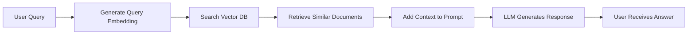

<Warning>
**Educational Guide Only - Not Production Ready**

This guide is designed for **educational purposes** to help you understand RAG concepts and how they work in LarAgent and AI development. The prompts, configurations, and implementations provided here are **not fine-tuned or extensively tested** for production use.

Please note:

- Some features or approaches may become outdated or deprecated over time
- The code examples are simplified to demonstrate core concepts
- This guide serves as a **starting point** that requires further refinement
- **Thoroughly test and polish** all implementations before deploying to production
- Adapt security measures, error handling, and validation to your specific use case

Use this guide to learn and experiment, then build upon it with production-grade practices.

</Warning>

<Note>
  Vector-based RAG (Retrieval-Augmented Generation), often referred to as
  Traditional RAG, is a powerful technique that stores text documents as
  vectors: the same mathematical representation that LLMs use for understanding
  words and concepts - and compares user queries against these vectors to
  retrieve relevant context.
</Note>

In this guide, we'll implement a **customer support agent** that answers questions based on FAQ documents stored in a vector database. The agent will intelligently retrieve relevant documentation and use it to provide accurate, context-aware responses.

## How Vector-Based RAG Works



The process flow:

1. User asks a question
2. The question is converted into a vector embedding
3. The vector database finds documents with similar embeddings
4. Retrieved documents are added as context
5. The LLM generates a response based on the context
6. User receives an accurate, documentation-based answer

## Prerequisites

Before starting this guide, make sure you have:

<AccordionGroup>
  <Accordion title="LarAgent Installed">
    You should have LarAgent installed and configured. If not, check the [Quickstart](/quickstart) guide.
    
    ```bash
    composer require maestroerror/laragent
    ```
  </Accordion>

    <Accordion title="Vector Search Service">
    You can choose any vector database solution, but if you're not sure what to pick, these three are recommended:
    - **[Qdrant](https://github.com/hkulekci/qdrant-php)**
    - **[Pinecone](https://github.com/probots-io/pinecone-php)**
    - **[pgvector](https://github.com/pgvector/pgvector)**
      - If your project uses PostgreSQL, the pgvector extension is also a good option
    </Accordion>

  <Accordion title="Embeddings Generator">
    We recommend using `openai-php/client` since LarAgent already provides it as a dependency, so you won't need to install anything extra.
    
    However, you can use any embeddings generator, including open-source models running locally.
    
    Just make sure you use the same generator for user queries as you use for generating the documents vector representation
  </Accordion>
</AccordionGroup>

<Tip>
  Make sure you have your vector database running and accessible, and that you
  have API keys configured for your chosen embeddings provider.
</Tip>

## Implementation Steps

### Step 1: Create Your Agent

First, create a new agent using the artisan command:

```bash
php artisan make:agent SupportAgent
```

This will generate a new agent class at `app/AiAgents/SupportAgent.php`.

### Step 2: Define Instructions with Blade Template

Create a blade template for your agent's instructions. This makes it easy to maintain and allows for dynamic content.

Create a new file at `resources/views/prompts/support_agent_instructions.blade.php`:

```blade resources/views/prompts/support_agent_instructions.blade.php
# Purpose

You are a customer support agent of SaaS platform.
Your role is to assist users with their questions and issues related to the platform.

Answer questions based on the following Context provided to you.
If the Context does not contain information relevant to the user's question, respond with:
"I'm sorry, I don't have that information right now. Please contact our support team at support@helloworld.com for further assistance."

**Important Guidelines:**
- Only answer based on the provided Context
- Be helpful, friendly, and professional
- If you're unsure, avoid guessing, ask to contact the support team
- Provide clear, concise answers

Current Date: {{ $date }}

## Current User

Name: {{ $user->name ?? 'Valued Customer' }}
Email: {{ $user->email ?? 'N/A' }}
Account Type: {{ $user->subscription_type ?? 'Free' }}
```

Now, update your `SupportAgent.php` to use this template:

```php app/AiAgents/SupportAgent.php
<?php

namespace App\AiAgents;

use LarAgent\Agent;

class SupportAgent extends Agent
{
    protected $model = 'gpt-4o';
    protected $history = 'cache';
    protected $temperature = 0.6; // Lower temperature for more consistent, factual responses
    protected $maxCompletionTokens = 500;

    public function instructions()
    {
        return view('prompts.support_agent_instructions', [
            'date' => now()->format('F j, Y'),
            'user' => auth()->user(),
        ])->render();
    }

    public function prompt($message)
    {
        // We'll add RAG logic here in the next steps
        return $message;
    }
}
```

### Step 3: Create a Search Service

Create a service to handle vector search operations. We'll use `QdrantSearchService` as an example which has following API:

```php app/Services/QdrantSearchService.php

namespace App\Services;

class QdrantSearchService
{
    public function convertToEmbeddings(string $text): array;
    public function search(string $query, int $limit = 10): array;
    public function importDocumentToCollection(array $document, string $collectionName): bool;
}
```

<Tip>
  For vector databases (including Pinecone or Qdrant), the search logic will be
  similar but with different client implementations: The key is to generate
  embeddings on each new document added and perform similarity search or them
  when agent gets a question.
</Tip>

### Step 4: Configure Environment Variables

Add your vector database and OpenAI credentials to `.env`:

```env .env
OPENAI_API_KEY=your_openai_api_key_here

# Qdrant Configuration
QDRANT_HOST=http://localhost:6333
QDRANT_API_KEY=your_qdrant_api_key
```

### Step 5: Implement RAG in the Prompt Method

Now, integrate the search service into your agent's `prompt` method. Create a context template first:

```blade resources/views/prompts/support_agent_context.blade.php
# Context

The following documents from our knowledge base may be relevant to the user's question:

@foreach($documents as $index => $doc)
## Document {{ $index + 1 }}: {{ $doc['title'] }}

{{ $doc['content'] }}

---
@endforeach

Use this context to answer the user's question accurately. If the context doesn't contain relevant information, let the user know.
```

Update your `SupportAgent.php` to use RAG:

```php app/AiAgents/SupportAgent.php
<?php

namespace App\AiAgents;

use LarAgent\Agent;
use LarAgent\Messages\DeveloperMessage;
use App\Services\QdrantSearchService;

class SupportAgent extends Agent
{
    protected $model = 'gpt-4o-mini';
    protected $history = 'cache';
    protected $temperature = 0.3;
    protected $maxCompletionTokens = 500;

    public function instructions()
    {
        return view('prompts.support_agent_instructions', [
            'date' => now()->format('F j, Y'),
            'user' => auth()->user(),
        ])->render();
    }

    public function prompt($message)
    {
        // Search for relevant documents
        $searchService = new QdrantSearchService();
        $documents = $searchService->search($message, limit: 3);

        // Only add context if we found relevant documents
        if (!empty($documents)) {
            // Format the context using blade template
            $context = view('prompts.support_agent_context', [
                'documents' => $documents,
            ])->render();

            // Add context as a developer message
            $devMsg = new DeveloperMessage($context);
            $this->chatHistory()->addMessage($devMsg);
        }

        return $message;
    }
}
```

<Note>
  The `DeveloperMessage` role is perfect for RAG context because it can be
  inserted at any point in the chat history sequence without disrupting the
  conversation flow between user and assistant messages.
</Note>

## Testing Your RAG Implementation

### Interactive Testing

Test your agent using the built-in chat command:

```bash
php artisan agent:chat SupportAgent
```

Try asking questions from your documentation:

<CodeGroup>
```text Example Questions
"How do I create a new user?"
"Who has invented the lightbulb?"
"What are the pricing plans available?"
"What's the difference between Basic and Pro plans?"
```

```text Expected Behavior
✅ Agent retrieves relevant FAQ documents
✅ Provides accurate answers based on context
✅ Admits when information is not available
✅ Maintains conversation context across messages
```

</CodeGroup>

### Programmatic Testing

You can also test programmatically in your application:

```php
use App\AiAgents\SupportAgent;

// For authenticated users
$response = SupportAgent::forUser(auth()->user())
    ->respond('How do I create a new email campaign?');

str_contains($response, "test_string");

// For named sessions
$response = SupportAgent::for('test_session')
    ->respond('What are the pricing plans?');

str_contains($response, "test_string");
```

### Debugging Tips

<Steps>
    <Step title="Check Vector Search Results">
        Add logging to see what documents are being retrieved: ```php $documents =
        $searchService->search($message, limit: 3); \Log::info('Retrieved
        documents:', $documents); ```
    </Step>

    <Step title="Verify Embeddings">
        Ensure your embeddings are being generated correctly and match the dimensions
        expected by your vector database.
    </Step>

    <Step title="Monitor Token Usage">
        Keep an eye on token consumption, especially when adding multiple documents
        as context. ```protected $contextWindowSize = 4000; // Adjust based on
        your needs ```
    </Step>

</Steps>

## Next Steps

<CardGroup cols={2}>
  <Card title="Add Guardrails" icon="shield-check">
    Implement safeguards to prevent hallucination and keep conversations
    on-topic
  </Card>
  <Card title="Explore Other RAG Types" icon="flask">
    Learn about advanced RAG techniques like retrieval-as-tool or hybrid search
  </Card>
  <Card title="Optimize Performance" icon="gauge-high">
    Fine-tune your vector search parameters and caching strategies
  </Card>
  <Card title="Monitor Quality" icon="chart-line">
    Track answer quality and user satisfaction metrics
  </Card>
</CardGroup>

### Adding Guardrails

To prevent hallucinations and off-topic questions, consider:

1. **Score Thresholding**: Only use documents with similarity scores above a threshold:

```php
$documents = array_filter($documents, function($doc) {
    return $doc['score'] > 0.7; // Adjust threshold as needed
});
```

2. **Explicit Instructions**: Make your system prompt very clear about staying on topic:

```blade
If the user asks about topics unrelated to HelloWorld or our services,
politely redirect them: "I'm specialized in helping with HelloWorld platform questions.
For other topics, please visit our general contact page."
```

3. **Content Filtering**: Pre-filter your document collection to only include appropriate content.

### Exploring Other RAG Approaches

Now that you've mastered vector-based RAG, consider exploring:

- **Hybrid Search**: Combining vector similarity with keyword search for better accuracy
- **Re-ranking**: Using a second model to re-rank retrieved documents
- **Retrieval-as-Tool**: Letting the agent decide when to retrieve information
- **Multi-modal RAG**: Including images and other media in your knowledge base

---

<Tip>
  For more information about RAG fundamentals in LarAgent, check the [RAG Core
  Concept](/core-concepts/rag) documentation.
</Tip>

## Summary

You've now implemented a fully functional vector-based RAG system with LarAgent! Your support agent can:

- ✅ Retrieve relevant documentation based on user queries
- ✅ Provide accurate, context-aware responses
- ✅ Maintain conversation history
- ✅ Gracefully handle questions without available context

This foundation can be extended and customized for various use cases beyond customer support, such as internal knowledge bases, educational assistants, or technical documentation helpers.
